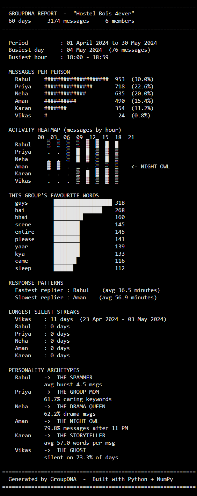
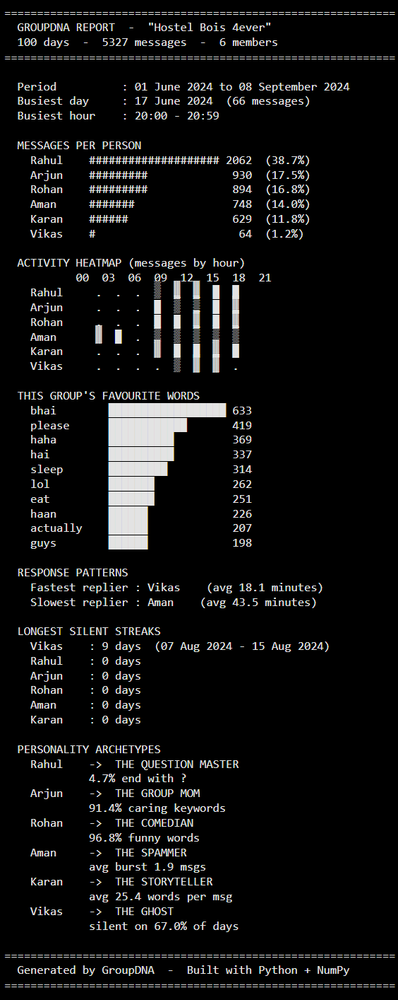

# GroupDNA - WhatsApp Chat Analyzer

**GroupDNA** is a Python-based WhatsApp chat analyzer that turns a raw WhatsApp group export into a fun, structured, screenshot-ready report.

Think of it as **"Spotify Wrapped, but for your WhatsApp group."** 😄

It analyzes group activity, message patterns, favourite words, response behavior, silent streaks, and assigns fun personality archetypes to each member.

---

## Outputs

### Sample Output

This is the main sample output generated from the provided sample chat dataset.



### Testing Output

This is an additional testing output generated by running the same analyzer on another WhatsApp chat export.



---

## Project Overview

This project reads a WhatsApp `.txt` export, parses valid messages, skips system/media/deleted-message noise, and generates a clean text-based report using Python fundamentals and NumPy.

The final report shows:

- Total messages and chat duration
- Messages per person
- Peak chatting day and hour
- Activity heatmap by hour
- Most-used group words
- Fastest and slowest repliers
- Longest silent streaks
- Fun personality archetypes for each member

---

## Dataset Files

This repository includes two chat datasets/outputs:

| File | Purpose |
|---|---|
| `hostel_bois.txt` | Main sample WhatsApp chat dataset |
| `image.png` | Sample output screenshot generated from the sample dataset |
| `whatsapp_sample.txt` | Additional WhatsApp chat dataset used for testing |
| `Output.png` | Testing output screenshot generated from the testing dataset |

---

## Sample Output Summary

The sample output is generated from a synthetic WhatsApp group chat named **"Hostel Bois 4ever"**.

| Metric | Value |
|---|---:|
| Chat period | 01 April 2024 to 30 May 2024 |
| Duration | 60 days |
| Parsed messages | 3,174 |
| Participants | 6 |
| Busiest day | 04 May 2024 |
| Busiest day messages | 76 |
| Busiest hour | 18:00 - 18:59 |

### Sample Personality Results

| Participant | Archetype | Reason |
|---|---|---|
| Rahul | THE SPAMMER | Average burst of 4.5 messages |
| Priya | THE GROUP MOM | 61.7% caring keyword score |
| Neha | THE DRAMA QUEEN | 62.2% drama-style messages |
| Aman | THE NIGHT OWL | 79.8% of messages after 11 PM |
| Karan | THE STORYTELLER | Average 57.0 words per message |
| Vikas | THE GHOST | Silent on 73.3% of days |

---

## Testing Output Summary

The testing output is generated from another WhatsApp group chat export named **"Hostel Bois 4ever"**.

| Metric | Value |
|---|---:|
| Chat period | 01 June 2024 to 08 September 2024 |
| Duration | 100 days |
| Parsed messages | 5,327 |
| Participants | 6 |
| Busiest day | 17 June 2024 |
| Busiest day messages | 66 |
| Busiest hour | 20:00 - 20:59 |

### Testing Messages Per Person

| Participant | Messages | Share |
|---|---:|---:|
| Rahul | 2,062 | 38.7% |
| Arjun | 930 | 17.5% |
| Rohan | 894 | 16.8% |
| Aman | 748 | 14.0% |
| Karan | 629 | 11.8% |
| Vikas | 64 | 1.2% |

### Testing Favourite Group Words

| Word | Count |
|---|---:|
| bhai | 633 |
| please | 419 |
| haha | 369 |
| hai | 337 |
| sleep | 314 |
| lol | 262 |
| eat | 251 |
| haan | 226 |
| actually | 207 |
| guys | 198 |

### Testing Response Patterns

| Category | Member | Average Response Time |
|---|---|---:|
| Fastest replier | Vikas | 18.1 minutes |
| Slowest replier | Aman | 43.5 minutes |

### Testing Silent Streaks

| Participant | Longest Silent Streak |
|---|---:|
| Vikas | 9 days, from 07 Aug 2024 to 15 Aug 2024 |
| Rahul | 0 days |
| Arjun | 0 days |
| Rohan | 0 days |
| Aman | 0 days |
| Karan | 0 days |

### Testing Personality Archetypes

| Participant | Archetype | Reason |
|---|---|---|
| Rahul | THE QUESTION MASTER | 4.7% of messages end with `?` |
| Arjun | THE GROUP MOM | 91.4% caring keyword score |
| Rohan | THE COMEDIAN | 96.8% funny word score |
| Aman | THE SPAMMER | Average burst of 1.9 messages |
| Karan | THE STORYTELLER | Average 25.4 words per message |
| Vikas | THE GHOST | Silent on 67.0% of days |

---

## Repository Structure

```text
GroupDNA/
├── GroupDNA_Project_GVaishanth.ipynb   # Main analysis notebook
├── hostel_bois.txt                     # Main sample WhatsApp chat dataset
├── image.png                           # Sample output screenshot
├── whatsapp_sample.txt                 # Additional testing chat dataset
├── Output.png                          # Testing output screenshot
├── README.md                           # Project documentation
└── .gitattributes
```

---

## Features

### 1. WhatsApp Chat Parser

Parses raw WhatsApp export lines into structured message records.

It handles:

- Valid chat messages
- Multiline messages
- System messages
- Media omitted messages
- Deleted messages
- Participant extraction

---

### 2. Group Overview

Generates high-level group statistics:

- Total messages
- Chat date range
- Number of participants
- Messages per person
- Percentage contribution by each member

---

### 3. Activity Analysis

Finds the group's activity patterns:

- Busiest day
- Busiest hour
- Hour-wise message distribution

---

### 4. NumPy Activity Heatmap

Builds a participant-by-hour activity matrix using NumPy and renders it as text art.

Example symbols:

```text
.  low/no activity
░  light activity
▒  medium activity
█  high activity
```

No external visualization library is used.

---

### 5. Word Frequency Analysis

Counts commonly used words across the group and shows the top words using text-based bar charts.

---

### 6. Response Pattern Analysis

Calculates who replies the fastest and slowest on average by measuring response gaps between different senders.

---

### 7. Silent Streak Detection

Checks each day in the chat period and calculates the longest stretch where a participant sent zero messages.

---

### 8. Personality Archetype Detection

Uses rule-based scoring to assign each member one fun group personality, such as:

- The Spammer
- The Night Owl
- The Storyteller
- The Ghost
- The Group Mom
- The Comedian
- The Question Master

---

## Technical Constraints

This project was intentionally built using only beginner-friendly Python concepts and NumPy.

### Used

- Python fundamentals
- Variables, loops, conditionals, and functions
- Lists, tuples, sets, and dictionaries
- File handling with `open()`
- `datetime` for date/time parsing
- NumPy for matrix-based activity analysis
- F-strings for report formatting

### Not Used

- Pandas
- Matplotlib, Seaborn, or Plotly
- `collections.Counter`
- `collections.defaultdict`
- Regex with `re`
- Machine learning or AI libraries

All visualizations are text-based and generated directly in the notebook output.

---

## Tools and Technologies

- **Python 3**
- **NumPy**
- **Jupyter Notebook**
- **WhatsApp chat export `.txt` format**

---

## How to Run the Project

### Option 1: Run Locally with Jupyter Notebook

1. Clone the repository:

```bash
git clone https://github.com/GVaishanth/GroupDNA.git
cd GroupDNA
```

2. Install dependencies:

```bash
pip install numpy jupyter
```

3. Start Jupyter Notebook:

```bash
jupyter notebook
```

4. Open and run:

```text
GroupDNA_Project_GVaishanth.ipynb
```

5. Make sure the chat export file is in the same folder as the notebook.

For the main sample output, use:

```text
hostel_bois.txt
```

For the testing output, use:

```text
whatsapp_sample.txt
```

Run all cells from top to bottom to reproduce the report.

---

### Option 2: Run in Google Colab

1. Open [Google Colab](https://colab.research.google.com)
2. Upload `GroupDNA_Project_GVaishanth.ipynb`
3. Upload the WhatsApp `.txt` dataset file
4. Update the filename in the notebook if needed
5. Run all cells

---

## Run It on Your Own WhatsApp Chat

You can also run GroupDNA on your own WhatsApp group export.

1. Open WhatsApp
2. Go to a group chat
3. Tap **Menu → More → Export chat**
4. Choose **Without media**
5. Save the exported `.txt` file
6. Place it in the project folder
7. Replace the filename in the notebook with your exported file name
8. Run the notebook

> Privacy note: Do not publish real chat exports. If sharing results, share only screenshots of the final report and get permission from group members first.

---

## Key Learnings

This project helped me practice:

- Parsing messy text data without regex
- Building structured data from raw chat logs
- Creating counters manually with dictionaries
- Working with dates and times
- Building a NumPy matrix for activity analysis
- Designing text-based visual reports
- Creating rule-based personality classification logic

---

## Possible Future Improvements

- Add support for multiple WhatsApp date formats
- Export the final report as a `.txt` or `.pdf` file
- Add charts using Matplotlib or Seaborn
- Add sentiment analysis
- Build a Streamlit dashboard
- Improve stop-word handling for Hinglish and slang
- Add privacy masking for participant names

---

## Author

**G. Vaishanth**

- GitHub: [GVaishanth](https://github.com/GVaishanth)

---

## Disclaimer

The included WhatsApp chat datasets are synthetic and intended for learning, demonstration, and portfolio purposes. The archetypes and insights are generated using simple rule-based logic and should be interpreted as fun analytical summaries, not serious personality judgments.

---

## AI-Assistance Disclosure

AI was used as a learning aid for selected debugging and review tasks, including multiline parsing review, silent-streak logic correction, heatmap normalization guidance, and stop-word tuning. All calculations and report values are generated by running the notebook code on the dataset.
